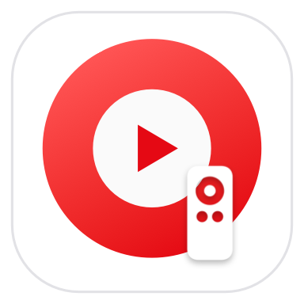

<p align="center">
  
</p>

# YouTube Music MCP

[](https://github.com/ramin0/youtube-music-mcp/releases/latest)
[](LICENSE)
[](https://modelcontextprotocol.io)

Control YouTube Music from MCP clients through the [Model Context Protocol](https://modelcontextprotocol.io).

A macOS Safari bridge that lets Codex, Claude Code, Claude Desktop, Gemini CLI, GitHub Copilot, Cursor, VS Code, Windsurf, and similar MCP-compatible clients control YouTube Music through a local bridge app and Safari extension.

## Features

- **Playback control** - play, pause, next, previous, seek, and volume control through natural language
- **Search and play** - search YouTube Music and immediately play the first result, all via MCP
- **Repeat and shuffle** - set repeat mode to `off`, `one`, `all`, or an A-B section loop, plus shuffle `on`, `off`, or `toggle`
- **Auto-reconnect** - resilient WebSocket with exponential backoff that survives tab switches, sleep, and network changes
- **Menu bar app** - lightweight native macOS bridge runs in the menu bar with no Dock icon clutter
- **Multi-tab support** - list and target specific YouTube Music tabs when multiple are open

## Documentation

- [Setup Guide](docs/youtube-music-mcp/setup-guide.md) - client-specific setup for Codex, Claude Code, Claude Desktop, Cursor, Gemini CLI, GitHub Copilot, VS Code, and Windsurf
- [Architecture Decision Records](docs/youtube-music-mcp/adr/README.md) - design decisions and constraints

## How It Works

```
MCP Client
    |  MCP / JSON-RPC
    v
Go MCP Server
    |  HTTP / localhost:8765
    v
macOS Bridge App
    |  WebSocket
    v
Safari Extension
    |  DOM automation
    v
YouTube Music
```

Requests start in your MCP client, pass through the local Go server and bridge app, then land in the active YouTube Music tab running in Safari.

## MCP Tools

| Tool | Description |
|---|---|
| `list_youtube_music_tabs` | List connected YouTube Music tabs |
| `get_playback_state` | Current track, position, volume, repeat and shuffle state |
| `play` | Resume playback |
| `pause` | Pause playback |
| `next_track` | Skip to next track |
| `previous_track` | Go to previous track |
| `set_volume` | Set volume (0-100%) |
| `seek` | Seek to position in seconds |
| `set_repeat_mode` | `off`, `one`, `all`, or `section` (A->B loop) |
| `set_shuffle` | `on`, `off`, or `toggle` |
| `search_and_play` | Search and play the first result |

## MCP Clients

Common MCP hosts mentioned across popular GitHub MCP server docs include Claude Code, Claude Desktop, Codex, Cursor, Gemini CLI, GitHub Copilot, VS Code, and Windsurf.

## Quick Start

### 1. Install the bridge app from the DMG

Download the latest DMG from the [GitHub releases page](https://github.com/ramin0/youtube-music-mcp/releases/latest), drag **YouTube Music MCP Bridge.app** to `Applications`, and open it once.

### 2. Enable the Safari extension

In Safari, go to **Settings > Extensions**, enable **YouTube Music MCP Bridge**, then open `music.youtube.com`.

### 3. Follow the setup guide for your client

The [setup guide](docs/youtube-music-mcp/setup-guide.md) includes client-specific setup for Codex, Claude Code, Claude Desktop, Cursor, Gemini CLI, GitHub Copilot, VS Code, and Windsurf.

### 4. Ask your client to play music

Example prompts:

- `Play some lo-fi hip hop on YouTube Music`
- `Search for Amr Diab and play the first result`
- `Set volume to 35%`
- `Loop the section from 52 seconds to 1 minute 7 seconds`

## License

[MIT](LICENSE)
