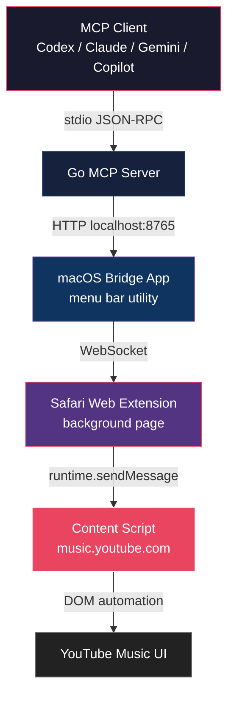

# ADR 001: Three-Tier Architecture

## Status

Accepted

## Context

We need to let MCP clients such as Codex, Claude Code, Claude Desktop, Gemini CLI, GitHub Copilot, Cursor, VS Code, and Windsurf control YouTube Music playback in Safari. Safari Web Extensions have strict security constraints:

- Content scripts on HTTPS pages cannot make requests to `http://localhost` (mixed content)
- Safari MV3 service workers cannot make network requests to localhost at all
- There is no Chrome DevTools Protocol equivalent for Safari

We need a way to bridge the gap between an MCP server (which speaks stdio JSON-RPC) and the YouTube Music DOM running inside Safari.

## Decision

Use a three-tier architecture:

### Layer Responsibilities

| Layer | Language | Role |
|---|---|---|
| Go MCP Server | Go | Translates MCP tool calls into HTTP requests to the bridge |
| macOS Bridge App | Swift | HTTP + WebSocket server; relays commands to the extension |
| Safari Extension | TypeScript | WebSocket client; executes DOM actions on YouTube Music |

### Why Three Tiers Instead of Two?

A direct MCP-to-extension connection is impossible because:
1. MCP servers communicate over stdio — they cannot host a WebSocket server
2. Safari extensions cannot initiate outbound connections to arbitrary processes
3. The bridge app solves both: it hosts a stable WebSocket endpoint that both the MCP server (via HTTP) and the extension (via WebSocket) can reach

## Consequences

- **Pro**: MCP server is stateless; multiple instances can run concurrently
- **Pro**: Bridge app runs persistently in the menu bar; extension reconnects automatically
- **Pro**: Each layer can be developed and tested independently
- **Con**: Three processes must be running for the system to work
- **Con**: Added latency from the extra hop (typically < 50ms)
