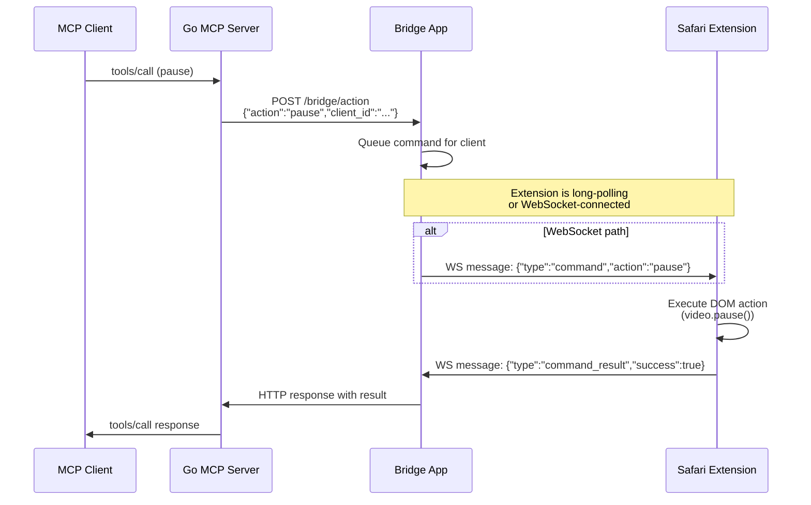
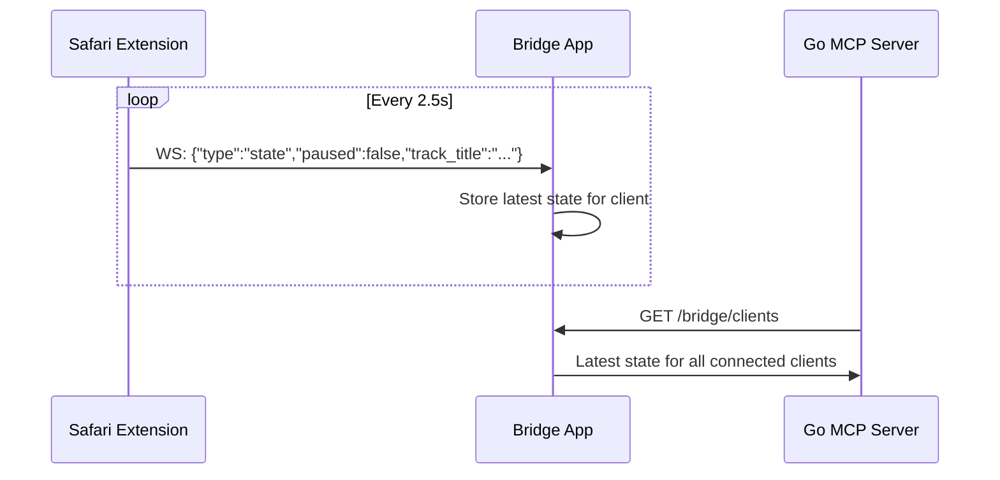
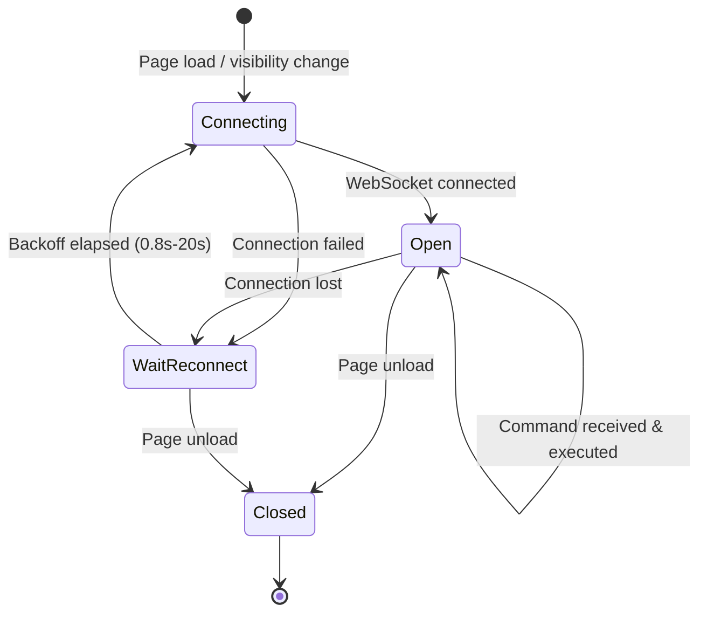

# ADR 002: Command Execution Flow

## Status

Accepted

## Context

When an MCP client asks to perform an action (e.g., "pause playback"), the request must travel through three processes and return a result. We need a reliable, low-latency command dispatch mechanism.

## Decision

### Command Flow

### State Heartbeat Flow

The extension sends playback state to the bridge every 2.5 seconds, independent of commands:

### WebSocket Connection Lifecycle

### Reconnection Backoff

- Initial delay: 800ms
- Maximum delay: 20s
- Strategy: exponential with jitter
- Resets to initial on successful connection
- Triggers native messaging to auto-launch bridge app if not running

## Consequences

- **Pro**: Commands execute in < 100ms typical round-trip
- **Pro**: State is always fresh (2.5s heartbeat)
- **Pro**: Resilient to transient disconnects (auto-reconnect)
- **Con**: Extension must be active on a YouTube Music page for commands to work
- **Con**: State is eventually consistent (up to 2.5s stale)
