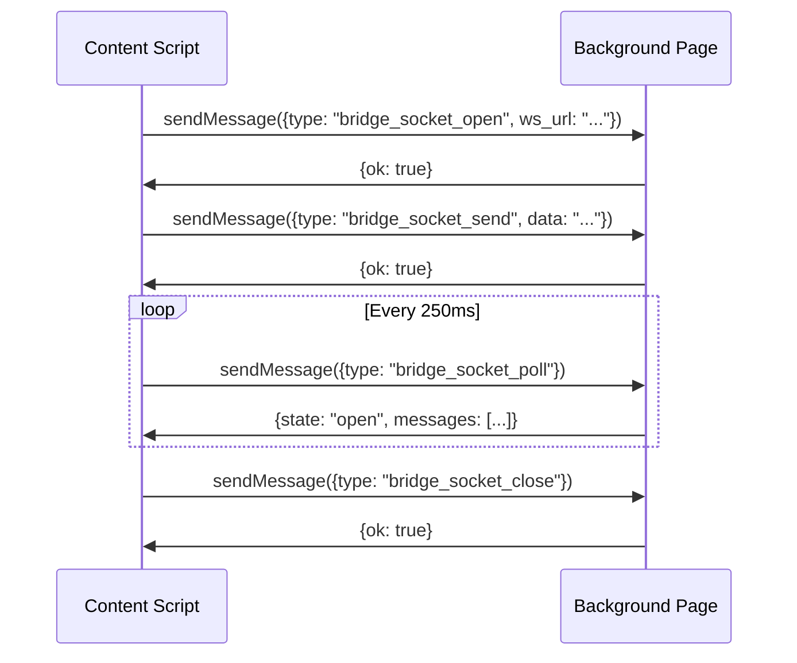

# ADR 003: Safari Extension Transport Constraints

## Status

Accepted

## Context

Safari Web Extensions (Manifest V3) impose strict constraints on how extension code can communicate with localhost services. We hit three major blockers during development.

## Decision

### Problem 1: Content Scripts Cannot Connect to localhost

Content scripts injected into `https://music.youtube.com` cannot make `ws://` or `http://` requests to localhost. This is a mixed-content security restriction.

**Solution**: Proxy all WebSocket connections through the background page.


### Problem 2: Service Workers Cannot Access localhost

Safari MV3 service workers (`"service_worker"` in manifest.json) cannot make any network requests to `127.0.0.1` or `localhost`, even with `NSAllowsLocalNetworking` in Info.plist.

**Solution**: Use `"scripts"` instead of `"service_worker"` in manifest.json background configuration. This gives us a persistent background page instead of a service worker.

```json
{
  "background": {
    "scripts": ["background.js"],
    "persistent": false
  }
}
```

### Problem 3: Port-Based Messaging Doesn't Work

Safari MV3 does not support `runtime.onConnect` / `Port`-based messaging between content scripts and background pages.

**Solution**: Use request/response polling pattern via `runtime.sendMessage`:



The `ExtensionBridgeSocket` class in `bridge-socket.ts` wraps this polling pattern behind a standard WebSocket-like API (`addEventListener`, `send`, `close`, `readyState`).

## Consequences

- **Pro**: Works reliably in Safari with all security restrictions satisfied
- **Pro**: `ExtensionBridgeSocket` provides a clean abstraction — the rest of the code doesn't know it's polling
- **Con**: 250ms polling adds latency to message delivery
- **Con**: Background page uses more memory than a service worker
- **Con**: These workarounds are Safari-specific; Chrome/Firefox would need different transport code
