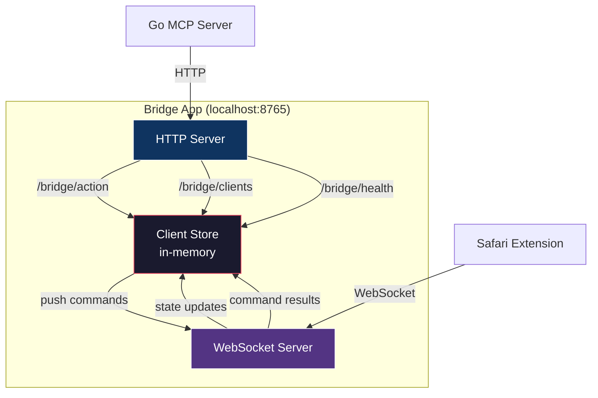
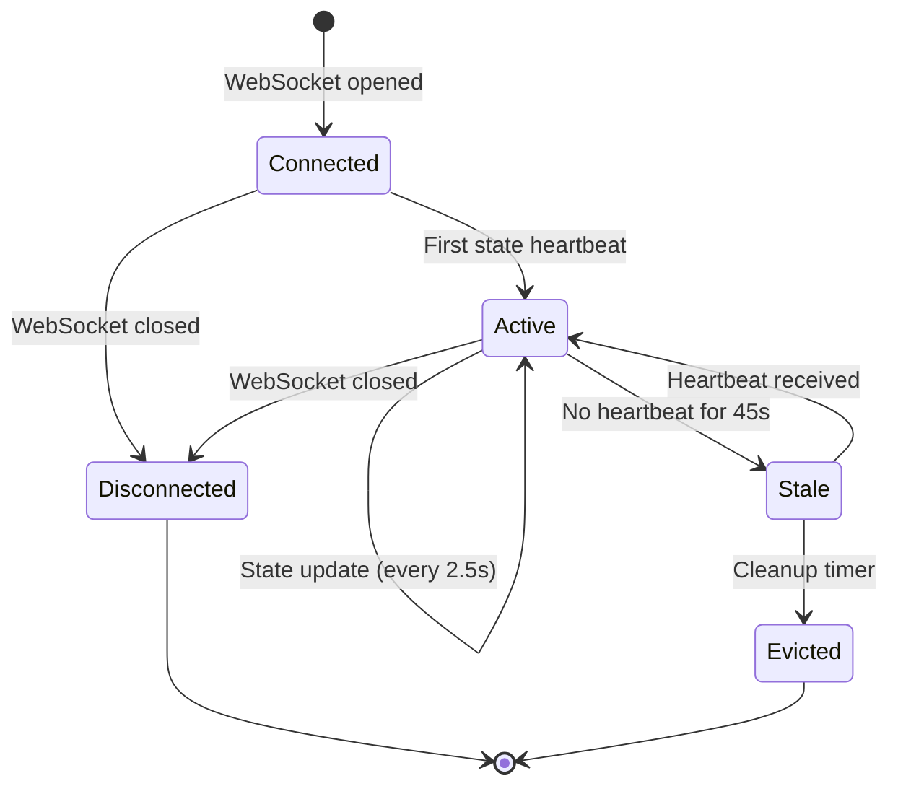

# ADR 004: macOS Bridge App Design

## Status

Accepted

## Context

The bridge app sits between the Go MCP server and the Safari extension. It needs to:

1. Host an HTTP API for the MCP server
2. Host a WebSocket endpoint for the Safari extension
3. Run persistently without cluttering the dock
4. Be easy to install (drag-to-Applications)

## Decision

### Architecture

### HTTP Endpoints

| Endpoint | Method | Purpose |
|---|---|---|
| `/bridge/health` | GET | Server status |
| `/bridge/clients` | GET | List connected clients with latest state |
| `/bridge/action` | POST | Dispatch command to a client |
| `/bridge/ws` | GET | WebSocket upgrade for extension connections |

### Menu Bar Utility

- Runs as `LSUIElement` (no dock icon)
- `NSApp.setActivationPolicy(.accessory)` prevents focus stealing
- Status item shows connection count badge
- Menu shows connected clients, track info, and playback progress

### Client Lifecycle

### Implementation

- Built with native Swift + `Network.framework` (NWListener, NWConnection)
- Manual WebSocket frame parsing (RFC 6455) — no third-party dependencies
- Single-process, single-thread event loop via GCD
- No persistent storage — all state is in memory and resets on restart

## Consequences

- **Pro**: Zero dependencies — pure Swift with system frameworks
- **Pro**: Invisible to user (menu bar only, no dock icon, no focus stealing)
- **Pro**: Stateless restarts are fine — extension reconnects automatically
- **Con**: Manual WebSocket implementation is more code to maintain
- **Con**: No persistent history or analytics across restarts
